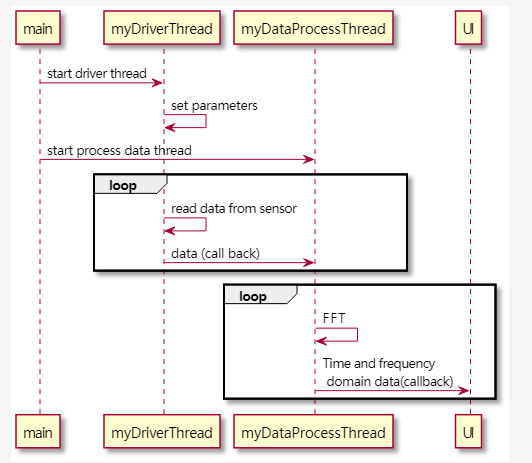

<h1 align="center">Guitartuner</h1>
<p align="center">
    <a href = "https://github.com/LancerMar/GuitarTuner">
        
    </a>
    <p align="center">A QT gui application that helps you tune your guitar</p>
</p>

<p align="center">
    <a href="https://www.youtube.com">Youtube link</a>
</p>

<p align="center">
    <a href="https://github.com/LancerMar/GuitarTuner/graphs/contributors" alt="Contributors">
        </a>
    <a href="https://github.com/LancerMar/GuitarTuner/issues" alt="Issues">
        </a>
    <a href="https://github.com/LancerMar/Guitartuner/blob/main/LICENSE" alt="License">
        </a>
    <a href="https://github.com/LancerMar/Guitartuner/releases" alt="Tag">
        </a>
</p>

## Contents
<ul>
    <li><a href="#About">About</a>
        <ul>
            <li><a href="#Functionality">Functionality</a>
            <li><a href="#Hardware">Hardware</a>
        </ul>
    <li><a href="#Quick-Start">Quick Start</a>
        <ul>
            <li><a href="#assembly-and-soldering">Assembly and Soldering</a>
            <li><a href="#raspberry-pi-for-wiring">Raspberry pi for wiring</a>
            <li><a href="#Running-Tests">Running Tests</a>
        </ul>
    <li><a href="#Usage">Usage</a>
    <li><a href="#Documentation">Documentation</a>
    <li><a href="#Stretch-Goals">Stretch Goals</a>
</ul>
            
## About
Guitartuner is a easy to run tuning application. It easily helps you tune your guitar with the help of a simple GUI.

### Functionality
 - Real-time standard tuning
 - Showing pitch frequency
### Hardware
 - Raspberry pi model 4b
 - [I2s microphone](https://www.adafruit.com/product/3421) 

## Quick Start
### Assembly and Soldering
[More details can be found here!](https://learn.adafruit.com/adafruit-i2s-mems-microphone-breakout/assembly)
### Raspberry pi for wiring 
[More datails](https://learn.adafruit.com/adafruit-i2s-mems-microphone-breakout/raspberry-pi-wiring-test), remember this is mono mic based project.
### Installation
Follow the following steps

1. Install the driver for i2s mic, [link](https://learn.adafruit.com/adafruit-i2s-mems-microphone-breakout/raspberry-pi-wiring-test), after the wiring section.

2. Install several dependenceis.

 - asound module 
 - fftw3 module
 - Qt module

```
sudo apt-get install libasound2-dev python3-pip libboost-test-dev 
sudo apt-get install libfftw3-dev 
sudo apt-get install qtdeclarative5-dev-tools libqwt-qt5-dev qtmultimedia5-dev
```

3. Configure dynamic linker run-time bindings

```
sudo ldconfig
```

## run the executable
you can compile the release version of our project by using following command on RaspberryPi
```linux 
mkdir release
cd release/
cmake -DCMAKE_BUILD_TYPE=Release ..
make
```
the **guitartuner** is the excutable file 
```linux
./guitartuner
```

## Debug
you can compile the debug version of our project by using following command on RaspberryPi
``` linux
mkdir debug
cd debug/
cmake -DCMAKE_BUILD_TYPE=Debug ..
make
```
the **guitartuner** is the excutable file 

you can use
``` linux
gdb -tui guitartuner
```
to debug this program 


# GuitarTuner
Tune the each open string of Guitar to standard pitch.

## Introduction
After using guitar for a long time, the string of the guitar will easily to be loose.The loose strings will cause the guitar string to be out of tune. In that way, we need a tuner to help us to redjust the string of each string.

The most convenient way to retune the guitar is to adjust each string when they are open. The standard frequency of each string is presented.

We run our software on **Raspberry Pi MOdel 4b**, and connect **a I2S microphone** on it. In that way we can receive the sound of guitar and analyse them in real-time.  

## Flow chart


## References

Use standard microphone get the real-time voice singnal of guitar，it help guitar users to calibrate the tones of each string.

According to Equal temperament(12 Equal temperament(12-TET)), we use 440Hz as our reference pitch, we got open tunings of each string.


Calculation Method:

Open string 1 E4 440.0000 / 2 ^ ( 5 / 12 ) = 329.6276 Hz

Open string 2 B3 440.0000 / 2 ^ ( 10 / 12 ) = 246.9417 Hz

Open string 3 G3 440.0000 / 2 ^ ( 14 / 12 ) = 195.9977 Hz

Open string 4 D3 440.0000 / 2 ^ ( 19 / 12 ) = 146.8324 Hz

Open string 5 A2 440.0000 / 2 ^ ( 24 / 12 ) = 110.0000 Hz

Open string 6 E2 440.0000 / 2 ^ ( 29 / 12 ) = 82.4069 Hz

## Sensor References
https://www.sparkfun.com/datasheets/BreakoutBoards/I2SBUS.pdf

https://cdn-learn.adafruit.com/downloads/pdf/adafruit-i2s-mems-microphone-breakout.pdf

# Diagram
## sequence diagram for data transfer


## FAQ
ALSA Library : sound driver ; get data from sound card(Linux)

arecord : can read the source, it`s helpful to write our own driver

FFtw 3 lib : FFT Processing library

display: recommended use QT 

install "Doxygen" :literate programme tool 
